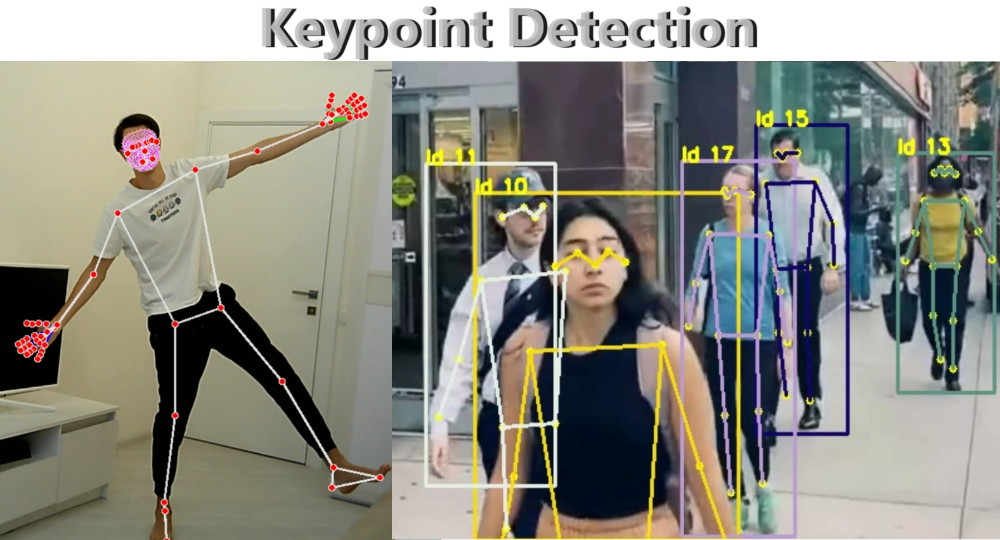

# __Анализ основных точек тела человека с использованием mediapipe (тело, лицо и руки) и YOLOv8-pose__


## __УСТАНОВКА:__
Необходимо иметь установленный python 3 любой версии (лучше 11). \
Данные команды требуется запускать последовательно в терминале:
1. Склонируйте к себе этот репозиторий 
```
git clone https://github.com/Koldim2001/KeypointsDetector.git
```
2. Перейдите с помощью команды cd в созданную папку KeypointsDetector
```
cd KeypointsDetector
```
3. Загрузите все необходимые библиотеки: 
```
pip install -r requirements.txt
```
PS: Лучше torch ставить сразу с поддержкой gpu __если она имеется__: 
```
pip install torch torchvision torchaudio --index-url https://download.pytorch.org/whl/cu121
```
4. Запустите желаемый ноутбук с кодом:
> Keypoints_pose.ipynb - в нем представлены подходы по анализу основных точек позы человека с использованием YOLOv8-pose (для трекинга большого числа людей) и mediapipe-pose

> Keypoints_face.ipynb - в нем представлены подходы по анализу основных точек лица (face mesh) с использованием mediapipe + контроль за зрачком 

> Keypoints_hand.ipynb - в нем представлены подходы по анализу основных точек руки с использованием mediapipe + обнаружение знаков 👍👎 + пример использования holistic модели для обнаружения всех точек тела одновременно  
---

## Webinar/Tutorial
Имеется подробный туториал по работе с данным репозиторием, в котором рассказаны основные теоретические и практические моменты по работе с детекцией точек тела\
Доступен по клику на иконку:\
[](https://www.youtube.com/watch?v=RIiQeWJgjLw&t=4730s)


